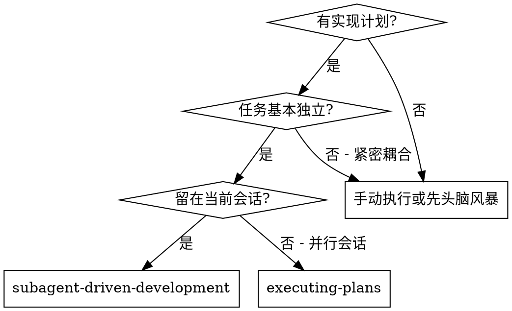
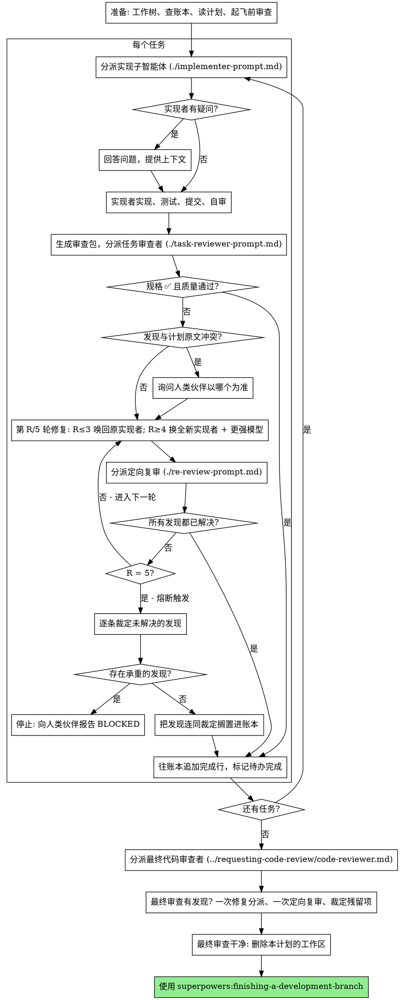

# 子智能体驱动开发

通过为每个任务分派一个全新的实现子智能体来执行计划：每个任务完成后做一次任务审查（规格合规性 + 代码质量），全部任务结束后再做一次覆盖整个分支的宽范围审查。

**为什么用子智能体：** 你把任务委派给具有隔离上下文的专用智能体。通过精心设计它们的指令和上下文，确保它们专注并成功完成任务。它们绝不应继承你会话的上下文或历史记录——你要精确构造它们所需的一切。这样也能为你自己保留用于协调工作的上下文。

**核心原则：** 每个任务一个全新子智能体 + 任务审查（规格 + 质量）+ 结尾宽范围审查 = 高质量、快速迭代

**旁白：** 工具调用之间最多说一句简短的旁白——进度账本和工具结果本身就是记录。

**持续执行：** 不要在任务之间停下来向你的人类伙伴确认。不间断地执行计划里的所有任务。唯一该停下的理由是：你无法解决的 BLOCKED 状态、确实妨碍推进的歧义，或所有任务已完成。"我该继续吗？"之类的询问和进度小结都在浪费他们的时间——他们让你执行计划，那就执行。

## 何时使用



**与 Executing Plans（并行会话）的对比：**
- 同一会话（无上下文切换）
- 每个任务全新子智能体（无上下文污染）
- 每个任务后做审查（规格合规性 + 代码质量），结尾做宽范围审查
- 更快的迭代（任务间无需人工介入）

## 流程



## 准备

确保工作发生在一个隔离的工作区里：用 superpowers:using-git-worktrees 创建一个，或者核实已有的那个。没有你人类伙伴的明确同意，绝不在 main/master 分支上开始实现。

会话记忆无法在上下文压缩（compaction）中存活。在真实会话里，丢失了位置的控制者曾重新分派整段已经完成的任务序列——这是观察到的最昂贵的失败。把进度记在一个账本文件里，而不只是记在待办里。

- **每个计划拥有自己的工作区：** 技能启动时，运行本技能的 `scripts/sdd-workspace PLAN_FILE`——它会打印这个计划专属的、被 git 忽略的目录（`<repo-root>/.superpowers/sdd/<计划文件名>/`），**本计划**的一切产物都放在那里：账本、简报、报告、审查包。别的计划的目录不属于你，不读也不写。
- 到 `<工作区>/progress.md` 查本计划的账本。如果它的第一行点名的是你的计划文件，那么带有 `Task <N>: complete` 行的任务就是**已完成**——不要重新分派它们；从第一个没有该行的任务处继续。如果某个任务的最后一行是一轮修复，说明它正卡在修复循环中：从下一轮继续。如果账本第一行点名的是**另一个**计划文件——或者你在旧的扁平路径 `.superpowers/sdd/progress.md` 发现了一个游离的账本——那是别人的进度：原地别动，另起你自己的新账本。
- 创建账本时，把它的身份写在第一行：`# SDD ledger — plan: <计划文件路径>`。
- 这个账本是你的恢复地图：它点名的那些提交，即使你的上下文已经不记得创建过它们，也确实存在于 git 中。压缩之后，相信账本和 `git log`，而不是你自己的记忆。
- `git clean -fdx` 会毁掉这个工作区（它是被 git 忽略的临时文件）；万一发生了，就从 `git log` 恢复。

把计划**读一遍**，记下它的上下文和全局约束，并为每个任务建一条待办。

在分派任务 1 之前，把计划通扫一遍找冲突：

- 互相矛盾的任务，或与计划的"全局约束"矛盾的任务
- 计划明确要求、但审查标准会判为缺陷的东西（比如一个什么都不断言的测试、一整块逻辑的逐字复制）

把你找到的所有问题**一次性打包成一个问题**呈现给你的人类伙伴——每条发现都并列上要求它的那段计划原文，问以哪个为准——在执行开始之前问，而不是执行过程中每发现一个就打断一次。如果扫描是干净的，就不要多说，直接开始。审查循环仍然是那些只有在实现中才浮现的冲突的兜底网。

## 模型选择

在能胜任的前提下，为每个角色选用最弱的模型，以节省成本、提升速度。

**机械性实现任务**（孤立的函数、清晰的规格、1-2 个文件）：用快而便宜的模型。计划写得好时，大多数实现任务都是机械性的。

**集成与判断类任务**（跨文件协调、模式匹配、调试）：用标准模型。

**架构与设计类任务**：用可用的最强模型。覆盖整个分支的最终审查就属于这一类——用可用的最强模型去分派它，不要用会话默认模型。

**审查任务**：用同样的判断来选模型，并按 diff 的体量、复杂度和风险来缩放。一个小的机械性 diff 不需要最强模型；一个微妙的并发改动需要。小修复 diff 的定向复审用便宜到中档的层级即可。

**修复循环的升级（第 4-5 轮）**：用比那个卡住了的实现者**至少高一档**的模型。

**分派子智能体时永远显式指定模型。** 省略模型会继承你会话的模型——往往是最强也最贵的那个——这会悄无声息地让本节的努力全部失效。

**轮次数比 token 单价更要紧。** 墙钟时间和上下文成本是随子智能体花掉多少轮次而增长的，而最便宜的模型在多步工作上经常要花 2-3 倍轮次——总账反而更贵。审查者、以及依据散文式描述工作的实现者，都以中档模型为下限。当任务的计划原文里已经包含了要写的完整代码时，实现就是抄写加测试：这种实现者用最便宜的层级。单文件的机械性修复也用最便宜的层级。

**任务复杂度信号（实现类任务）：**
- 涉及 1-2 个文件且规格完整 → 便宜模型
- 涉及多个文件且有集成考量 → 标准模型
- 需要设计判断或对代码库的广泛理解 → 最强模型

## 任务循环

你粘进分派提示词里的一切、以及子智能体打印回来的一切，都会在本次会话余下的时间里常驻你的上下文，并且在之后每一轮被重新读一遍。**产物要用文件来交接。**

### 1. 分派实现者

分派之前记录 BASE（`git rev-parse HEAD`）——审查包和各轮修复的 diff 都要用它。

- **任务简报：** 分派实现者之前，运行本技能的 `scripts/task-brief PLAN_FILE N`——它把该任务的完整文本抽取到一个唯一命名的文件并打印路径。组织你的分派，让这份简报保持为需求的唯一来源。你的分派应包含：(1) 一行说明这个任务在项目中的位置；(2) 简报路径，引入语为"先读这个——它是你的需求，里面有要逐字使用的精确取值"；(3) 简报无从知晓的、来自前序任务的接口和决策；(4) 你对简报中注意到的任何歧义的裁定；(5) 报告文件路径和报告契约。精确取值（数字、魔法字符串、签名、测试用例）只出现在简报里。**绝不**让子智能体去读整个计划文件。
- **报告文件：** 实现者的报告文件按简报来命名（简报 `…/task-N-brief.md` → 报告 `…/task-N-report.md`），并写进分派提示词。实现者把完整报告写在那里，只回传状态、提交、一行测试小结和疑虑。
- 一个分派提示词描述的是**一个任务**，不是会话的历史。不要把累积的前序任务小结（"任务 1-3 之后的状态"）粘进后面的分派——真实会话里曾出现过 42k 字符的分派，其中 99% 是粘贴的历史。一个全新的子智能体需要的是：它的任务、它要碰的接口、以及全局约束。别无其他。
- 如果前面某个任务把一条发现搁置在本任务要碰的区域，就在分派里带上指向那条账本记录的指针。
- **记下分派结果里实现者的智能体身份**——第 1-3 轮修复要唤回这个智能体。
- 绝不并行分派多个实现子智能体（会冲突）。

模板：[implementer-prompt.md](implementer-prompt.md)

### 2. 处理报告

实现子智能体会回传四种状态之一。分别处理：

**DONE：** 生成审查包（在本技能目录下运行 `scripts/review-package PLAN_FILE BASE HEAD`——它会打印出自己写入的那个唯一文件路径；BASE 是你在分派实现者之前记录下来的那个提交——**绝不用** `HEAD~1`，那会悄悄丢掉多提交任务里除最后一个之外的所有提交），然后把打印出的路径交给任务审查者去分派。

**DONE_WITH_CONCERNS：** 实现者完成了工作但提出了疑虑。继续之前先读这些疑虑。如果疑虑关乎正确性或范围，在审查之前先处理掉。如果只是观察（比如"这个文件变大了"），记下来，继续走审查。

**NEEDS_CONTEXT：** 实现者需要没被提供的信息。补上缺失的上下文并重新分派。

**BLOCKED：** 实现者无法完成任务。评估这个阻塞：
1. 如果是上下文问题，补充上下文并用同一个模型重新分派
2. 如果任务需要更多推理，用更强的模型重新分派
3. 如果任务太大，拆成更小的块
4. 如果是计划本身错了，上报给人类

**绝不**忽视一次上报，也**绝不**在什么都没改的情况下强迫同一个模型重试。如果实现者说它卡住了，那就一定有东西需要改变。

如果实现者提问——不论是开始前还是任务中途——清楚完整地回答，需要时补充上下文，不要催着它进入实现。

### 3. 审查任务

逐任务审查是**任务范围内的关卡**。宽范围审查只做一次，在最终的整分支审查那里。绝不跳过任务审查，也绝不接受一份缺少任一结论的报告——规格合规性**和**任务质量两者都必须有。实现者的自审永远不能替代任务审查；两者都需要。

- **把 diff 作为文件交给审查者：** 运行本技能的 `scripts/review-package PLAN_FILE BASE HEAD`，把它打印出的文件路径交给审查者（若没有 bash：对该区间跑 `git log --oneline`、`git diff --stat`、`git diff -U10`，重定向到一个唯一命名的文件）。这些输出永远不会进入你自己的上下文，而审查者在一次 Read 调用里就能看到提交列表、stat 摘要和带上下文的完整 diff。用你在分派实现者之前记录下的 BASE——**绝不用** `HEAD~1`，那会悄悄截断多提交任务。**绝不**在没有 diff 文件的情况下分派任务审查者。
- **审查者的输入：** 任务审查者拿到三个路径——同一份简报文件、报告文件、审查包——外加约束该任务的全局约束。
- 你交给审查者的全局约束块是它的**注意力透镜**。从计划的"全局约束"一节或规格里**逐字**抄下有约束力的需求：精确的取值、精确的格式，以及组件之间被明确规定的关系（"与 X 相同的布局"、"匹配 Y"）。审查者的模板里已经带了流程规则（YAGNI、测试卫生、审查方法）——约束块是用来装**这个项目**的规格所要求的东西的。
- 不要在没有具体的、任务专属的理由时，加上"检查所有用法"或"有用的话跑一下竞态测试"这类开放式指令
- 不要让审查者重跑实现者已经在同一份代码上跑过的测试——实现者的报告承载着测试证据
- **不要替审查者预先给发现定性**——绝不指示审查者忽略或不要标记某个具体问题。如果你认为某条发现会是误报，让审查者提出来，然后在审查循环里裁定它。如果你正在写的提示词里出现了"不要标记"、"不要把 X 当缺陷"、"顶多按 Minor 处理"、"计划选择了"——停下：你正在预先定性，而且通常是为了让自己少走一轮审查循环。

任务审查者可能报告"⚠️ 无法从 diff 核实"的条目——那些活在未改动代码里、或者跨任务的需求。这些不阻塞审查的其余部分，但在标记任务完成之前**你必须自己逐条解决它们**：你掌握着审查者所缺的计划和跨任务上下文。如果你确认某一条是真实的缺口，就把它当作规格审查失败来处理——它和其他发现一起进入修复循环。

模板：[task-reviewer-prompt.md](task-reviewer-prompt.md)

### 4. 修复循环

当审查报告规格 ❌、任何 Critical 或 Important 发现、或者你确认为真实缺口的 ⚠️ 条目时，循环触发。

循环开始之前，有两条路会立刻离开它：

- **Minor 发现**随手记进进度账本（`Task <N>: minor (deferred): <一句话>`），并把最终的整分支审查指向那份清单，让它去甄别哪些必须在合并前修掉。**没人读的汇总等于静默丢弃。** Minor 发现永远不进入循环。
- 被标为"计划要求的"发现——或任何与计划原文所要求的内容冲突的发现——和任何计划矛盾一样，属于**人类的决定**：把这条发现和那段计划原文一起呈现，问以哪个为准。不要因为计划要求就驳回这条发现，也不要在没问过的情况下分派一个与计划相违的修复。

其他一切都进入循环。**一轮修复 = 一次修复分派 + 一次定向复审。每个任务最多五轮。**

**第 1-3 轮——唤回原来那个实现者（resume）。** 把未解决的发现**逐字**发给它。它的上下文是完整的：它知道任务、知道代码、知道自己做过的选择。如果你的运行环境无法给一个活着的子智能体再发消息，就分派一个全新实现者，带上简报路径、报告文件路径和那些发现——无论走哪条路，报告文件都是那份持久化记忆。

**第 4-5 轮——用更强的模型分派一个全新实现者**（按"模型选择"），带上简报路径、报告文件路径、未解决的发现，以及这样的框定语："某个此前的实现者尝试过这个任务 [N] 次；现在它归你了。读报告文件了解已经试过什么。"一个熬过三次唤回的循环，通常意味着实现者看不见自己的问题——换新眼睛加提升能力，一步到位。

**每一轮，无论走哪条路：** 实现者修复、重跑覆盖被改动代码的测试、把修复报告追加到**同一个**报告文件、回传那个简短契约。重新分派审查者之前，先确认修复报告里含有覆盖用的测试、跑过的命令、以及输出；三者齐备才分派复审。在修复消息里点名覆盖用的测试文件——一行的修复不需要整包套件。

**复审是定向的。** 运行 `scripts/review-package PLAN_FILE FIX_BASE HEAD`，其中 FIX_BASE 是上一次审查所看到的那个 head，然后用 [re-review-prompt.md](re-review-prompt.md) 分派，附上发现清单、简报、报告文件和打印出的 diff 路径。复审者对每条发现给出 ADDRESSED 或 NOT ADDRESSED 的结论，并且**只**标记修复 diff 里的新破坏。修复 diff 里新出现的 Critical/Important 破坏加入未解决发现清单。范围外的观察作为延后的 Minor 进账本——它们永远不延长循环。

**每轮结束后**往账本追加：
`Task <N>: fix round <R>/5 (<X> addressed, <Y> open — <发现的一句话概括>; commits <a7>..<b7>)`

**绝不在控制者会话里自己修发现**——你的上下文要保持干净以供协调，而且控制者的修复会跳过审查。

**熔断。** 当第 5 轮的复审仍然留下未解决的发现时，**停止分派**。你自己逐条裁定这些未解决的发现——你掌握着审查者所缺的计划和跨任务上下文：

- **审查者错了，或者这一点是可争议的：** 搁置它——`Task <N>: parked — <发现> — ruling: <为什么代码可以维持原样>`。最终审查会看到双方说法。
- **是真实的，但下游没有任何东西建立在它之上：** 同样搁置，裁定里写明它是真的、被延后了。
- **真实且承重**——后面的任务建立在它之上，或者它揭示了一个计划缺陷：**停止**。追加 `Task <N>: BLOCKED — <原因>`，并连同这条发现、与之冲突的计划原文、以及修复历史一起报告给你的人类伙伴。把一个结构性失败搁置掉，会让每个依赖它的任务都建立在它之上，并且把一个最终审查同样无法修复的问题丢给最终审查。

**只在触及上限时才裁定。** 为了结束循环而提早裁定，只是换了个名字的"预先定性"。每一次裁定都是一条账本记录——**静默丢弃是禁止的**。

### 5. 完成任务

当审查干净地返回——或者在触及上限时每条未解决的发现都已带着裁定被搁置——在你做其他记账的同一条消息里，往账本追加完成行：

- `Task <N>: complete (commits <base7>..<head7>, review clean)`
- 熔断触发过的话：`Task <N>: complete (commits <base7>..<head7>, <K> parked)`

然后标记待办完成，继续下一个。**绝不**在审查还有未解决的 Critical/Important 问题、而它们既没被修复也没在上限处带裁定搁置时，就进入下一个任务。

## 最终审查

覆盖整个分支的最终审查也拿到一个审查包：运行 `scripts/review-package PLAN_FILE MERGE_BASE HEAD`（MERGE_BASE = 分支起点的那个提交，例如 `git merge-base main HEAD`），把打印出的路径放进最终审查的分派里，这样最终审查者读一个文件就行，不必用 git 命令重新推导整个分支的 diff。用可用的最强模型分派（见"模型选择"），使用 superpowers:requesting-code-review 的 [code-reviewer.md](../requesting-code-review/code-reviewer.md)。把它指向账本里那些"延后的 Minor"和"已搁置"的行，让它甄别哪些必须在合并前修掉。

如果覆盖整个分支的最终审查返回了发现，用**一个**修复子智能体带着**完整的**发现清单去分派——不要一条发现一个修复者。逐条发现各派一个修复者，每个都要重建上下文、重跑测试套件；真实会话里，一次最终审查的修复浪潮花掉的成本超过它全部任务的总和。然后对这波修复跑**恰好一次**定向复审（对修复区间跑 `scripts/review-package PLAN_FILE FIX_BASE HEAD`，用 [re-review-prompt.md](re-review-prompt.md)）。残留的发现按任务循环里熔断那套来裁定：带裁定搁置，或者在承重项上停下。**没有第二波修复**——残留的承重发现会在 finishing-a-development-branch 呈现选项时浮到你人类伙伴面前。

## 收尾

当覆盖整个分支的最终审查干净、且它的修复已合并时，删除**本计划**的工作区（`rm -rf <工作区>`）——现在 git 历史就是记录了。同级目录属于别的计划，别去动它们。

使用 superpowers:finishing-a-development-branch。

## 常见的合理化借口

| 借口 | 现实 |
|------|------|
| "规格合规性上差不多就行了" | 审查者发现了规格差距 = 未完成。修掉，或者走到上限去裁定——只有这两个出口。 |
| "我自己修就好了，分派是额外开销" | 控制者的修复会污染你的上下文并跳过审查。唤回实现者。 |
| "再来一轮就收敛了" | 过了上限，轮次不会收敛——那个失败是结构性的。裁定并分流。 |
| "反正审查者总会再挑出新东西" | 定向复审只核实修复，它不能到处乱逛。未改动代码上的新发现进账本，不进循环。 |
| "这条发现明显错了，我直接丢掉" | 你只在上限处裁定，而且每条裁定都是账本记录。静默丢弃是禁止的。 |
| "修复很小，跳过复审吧" | 未经审查的修复正是回归产生的方式。每一轮都以一次定向复审结束。 |
| "审查把循环拖慢了" | 没有审查的循环只是未经核实的空转。审查是这个循环的刹车和方向盘。 |
| "记账本是额外开销" | 账本是能在压缩中存活下来的东西。没有账本的控制者曾重新分派整段已完成的任务序列。 |

## 示例工作流

```
你：我正在用子智能体驱动开发来执行这个计划。

[准备：工作树已核实]
[把计划文件读一遍：docs/superpowers/plans/feature-plan.md]
[解析工作区：scripts/sdd-workspace docs/superpowers/plans/feature-plan.md —— 里面没有账本，全新开始]
[为所有任务创建待办]

任务 1：Hook 安装脚本

[对任务 1 运行 task-brief；分派实现者，附带简报 + 报告路径 + 上下文]

实现者："开始之前——这个 hook 应该装在用户级还是系统级？"

你："用户级（~/.config/superpowers/hooks/）"

实现者：[稍后]
  - 实现了 install-hook 命令
  - 加了测试，5/5 通过
  - 自审：发现漏了 --force 标志，已补上
  - 已提交

[运行 review-package PLAN_FILE BASE HEAD；把打印出的路径交给任务审查者去分派]
任务审查者：规格 ✅ —— 所有需求都满足，没有多余的东西。
  优点：测试覆盖良好，代码整洁。问题：无。任务质量：通过。

[账本：Task 1: complete (commits a1b2c3d..d4e5f6a, review clean)]

任务 2：恢复模式

[对任务 2 运行 task-brief；分派实现者，附带简报 + 报告路径 + 上下文]

实现者：[无疑问]
  - 加了 verify/repair 模式
  - 8/8 测试通过
  - 已提交

[运行 review-package PLAN_FILE BASE HEAD；把打印出的路径交给任务审查者去分派]
任务审查者：规格 ❌：
  - 缺失：进度上报（规格说"每 100 项上报一次"）
  问题（Important）：魔法数字（100）

[第 1 轮修复：唤回原实现者，带上这两条发现]
实现者：加了进度上报，把 PROGRESS_INTERVAL 提成了常量。
  重跑了 test/recovery.test.js —— 10/10 通过。修复报告已追加。

[运行 review-package PLAN_FILE FIX_BASE HEAD；分派定向复审]
复审者：缺失进度上报 —— ADDRESSED（src/recovery.js:41）。
  魔法数字 —— ADDRESSED（src/recovery.js:7）。新破坏：无。
  结论：所有发现均已解决。

[账本：Task 2: fix round 1/5 (2 addressed, 0 open; commits d4e5f6a..b7c8d9e)]
[账本：Task 2: complete (commits d4e5f6a..b7c8d9e, review clean)]

...

[所有任务之后]
[运行 review-package PLAN_FILE MERGE_BASE HEAD；分派最终代码审查者，用最强模型]
最终审查者：所有需求都满足。延后的 Minor 已甄别：没有阻塞合并的。

[删除本计划的工作区 —— 现在记录活在 git 里]

搞定！使用 superpowers:finishing-a-development-branch。
```
