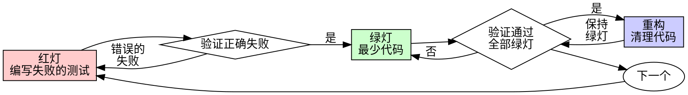

# 测试驱动开发（TDD）

## 概述

先写测试。看它失败。写最少的代码让它通过。

**核心原则：** 如果你没有看到测试失败，你就不知道它是否测试了正确的东西。

**违反规则的字面意思就是违反规则的精神。**

## 何时使用

**始终使用：**
- 新功能
- Bug 修复
- 重构
- 行为变更

**例外（需询问你的人类伙伴）：**
- 一次性原型
- 生成的代码
- 配置文件

想着"就这一次跳过 TDD"？停下来。那是在给自己找借口。

## 铁律

```
没有失败的测试，就不写生产代码
```

先写了代码再写测试？删掉它。从头来过。

**没有例外：**
- 不要保留作为"参考"
- 不要在写测试时"改编"它
- 不要看它
- 删除就是删除

从测试出发，重新实现。句号。

## 红-绿-重构



### 红灯 - 编写失败的测试

写一个最小的测试来展示期望行为。

<Good>
```typescript
test('retries failed operations 3 times', async () => {
  let attempts = 0;
  const operation = () => {
    attempts++;
    if (attempts < 3) throw new Error('fail');
    return 'success';
  };

  const result = await retryOperation(operation);

  expect(result).toBe('success');
  expect(attempts).toBe(3);
});
```
名称清晰，测试真实行为，只测一件事
</Good>

<Bad>
```typescript
test('retry works', async () => {
  const mock = jest.fn()
    .mockRejectedValueOnce(new Error())
    .mockRejectedValueOnce(new Error())
    .mockResolvedValueOnce('success');
  await retryOperation(mock);
  expect(mock).toHaveBeenCalledTimes(3);
});
```
名称模糊，测试的是 mock 而非代码
</Bad>

**要求：**
- 一个行为
- 清晰的名称
- 使用真实代码（除非不得已才用 mock）

### 验证红灯 - 看它失败

**必须执行。绝不跳过。**

```bash
npm test path/to/test.test.ts
```

确认：
- 测试失败（不是报错）
- 失败信息符合预期
- 失败原因是功能缺失（不是拼写错误）

**测试通过了？** 你在测试已有的行为。修改测试。

**测试报错了？** 修复错误，重新运行直到它正确地失败。

### 绿灯 - 最少代码

写最简单的代码让测试通过。

<Good>
```typescript
async function retryOperation<T>(fn: () => Promise<T>): Promise<T> {
  for (let i = 0; i < 3; i++) {
    try {
      return await fn();
    } catch (e) {
      if (i === 2) throw e;
    }
  }
  throw new Error('unreachable');
}
```
刚好够通过测试
</Good>

<Bad>
```typescript
async function retryOperation<T>(
  fn: () => Promise<T>,
  options?: {
    maxRetries?: number;
    backoff?: 'linear' | 'exponential';
    onRetry?: (attempt: number) => void;
  }
): Promise<T> {
  // YAGNI
}
```
过度设计
</Bad>

不要添加功能、重构其他代码或做超出测试要求的"改进"。

### 验证绿灯 - 看它通过

**必须执行。**

```bash
npm test path/to/test.test.ts
```

确认：
- 测试通过
- 其他测试仍然通过
- 输出干净（没有错误、警告）

**测试失败了？** 修改代码，不是测试。

**其他测试失败了？** 立即修复。

### 重构 - 清理代码

只有在绿灯之后才重构：
- 消除重复
- 改善命名
- 提取辅助函数

保持测试绿灯。不要添加行为。

### 重复

为下一个功能写下一个失败的测试。

## 好的测试

| 特质 | 好的 | 差的 |
|------|------|------|
| **最小化** | 只测一件事。名称中有"和"？拆分它。 | `test('validates email and domain and whitespace')` |
| **清晰** | 名称描述行为 | `test('test1')` |
| **展示意图** | 展示期望的 API | 掩盖了代码应该做什么 |

写任何测试、或修改任何测试时，阅读 [writing-good-tests.md](writing-good-tests.md)，那里是让测试保持诚实的规则：
- 在动手写之前，先点名那个会让该测试失败的生产代码改动
- 断言真实行为，绝不断言 mock 行为
- 只有测试才用的代码放在测试工具里，不进生产类
- 在 mock 一个依赖之前，先搞清它的副作用

## 常见借口

| 借口 | 现实 |
|------|------|
| "太简单了不用测" | 简单的代码也会出 bug。测试只需 30 秒。 |
| "我之后补测试" | 后写的测试立即通过——而立即通过什么都证明不了。它可能测错了对象、测的是实现而不是行为、或者漏掉你忘了的那个边界情况。你从没看着它失败过，所以你从没证明它能抓住 bug。先写测试逼你看到那次失败。 |
| "后补测试也能达到相同目的（重的是精神不是仪式）" | 后补测试回答的是"这做了什么？"；先写测试回答的是"这应该做什么？"后写的测试已经被你写好的代码带偏了——你验证的是你**记得**的那些情况，而不是你本该**发现**的那些。有覆盖率，没有测试有效的证明。 |
| "已经手动测试过了" | 手动测试是临时的：没有记录你覆盖了什么、代码一改就没法重跑、压力之下极易漏掉情况。"我试的时候是好的" ≠ 全面。自动化测试每次都以同样的方式运行。 |
| "删除 X 小时的工作太浪费" | 沉没成本谬误——那些时间无论怎样都已经花掉了。真正的选择是：用 TDD 重写（高置信度）vs 留着它事后补测试（低置信度、很可能有 bug）。留着你无法信任的代码才是浪费。 |
| "留作参考，然后先写测试" | 你会去改编它。那就是后补测试。删除就是删除。 |
| "需要先探索一下" | 可以。探索完了扔掉，从 TDD 开始。 |
| "测试难写 = 设计不清楚" | 听测试的。难以测试 = 难以使用。 |
| "TDD 会拖慢我" | TDD **就是**务实的那条路：在提交前抓住 bug、防止回归、让你能无所畏惧地重构。所谓"务实"的抄近道，等于在生产环境里调试——更慢，不是更快。 |
| "手动测试更快" | 手动测试无法证明边界情况。每次修改你都得重新测。 |
| "现有代码没有测试" | 你在改进它。为现有代码补测试。 |

## 危险信号 - 停下来，从头开始

- 先写了代码再写测试
- 实现完了才补测试
- 测试立即通过
- 无法解释测试为什么失败
- "之后再补"测试
- 说服自己"就这一次"
- "我已经手动测试过了"
- "后补测试也能达到相同目的"
- "重要的是精神不是仪式"
- "留作参考"或"改编现有代码"
- "已经花了 X 小时了，删掉太浪费"
- "TDD 太教条了，我是在务实"
- "这次情况不同，因为……"

**以上所有情况都意味着：删除代码。用 TDD 从头开始。**

## 示例：Bug 修复

**Bug：** 空邮箱被接受了

**红灯**
```typescript
test('rejects empty email', async () => {
  const result = await submitForm({ email: '' });
  expect(result.error).toBe('Email required');
});
```

**验证红灯**
```bash
$ npm test
FAIL: expected 'Email required', got undefined
```

**绿灯**
```typescript
function submitForm(data: FormData) {
  if (!data.email?.trim()) {
    return { error: 'Email required' };
  }
  // ...
}
```

**验证绿灯**
```bash
$ npm test
PASS
```

**重构**
如果需要，提取验证逻辑以支持多个字段。

## 验证清单

在标记工作完成之前：

- [ ] 每个新函数/方法都有测试
- [ ] 在实现之前看到每个测试失败
- [ ] 每个测试因预期原因失败（功能缺失，不是拼写错误）
- [ ] 为每个测试编写了最少代码使其通过
- [ ] 所有测试通过
- [ ] 输出干净（没有错误、警告）
- [ ] 测试使用真实代码（只在不可避免时用 mock）
- [ ] 覆盖了边界情况和错误场景

不能全部勾选？你跳过了 TDD。从头开始。

## 遇到困难时

| 问题 | 解决方案 |
|------|----------|
| 不知道怎么测试 | 写出你期望的 API。先写断言。问你的人类伙伴。 |
| 测试太复杂 | 设计太复杂。简化接口。 |
| 必须 mock 所有东西 | 代码耦合太紧。使用依赖注入。 |
| 测试 setup 太庞大 | 提取辅助函数。还是复杂？简化设计。 |

## 调试集成

发现 bug？写一个重现 bug 的失败测试。按 TDD 循环走。测试既证明了修复有效，又防止了回归。

绝不在没有测试的情况下修复 bug。

## 最终规则

```
生产代码 → 测试存在且先失败
否则 → 不是 TDD
```

没有你的人类伙伴的许可，没有例外。
